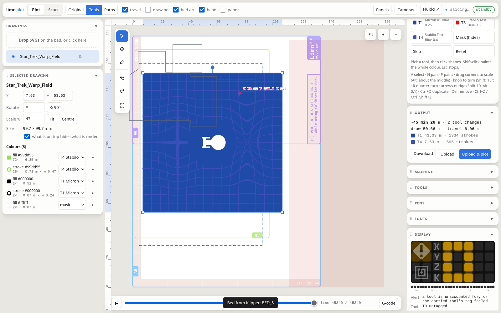
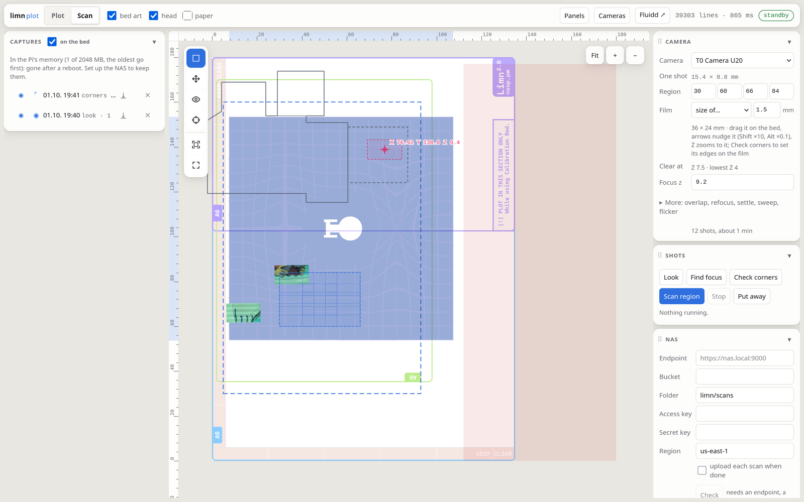

# Changelog

All notable changes to Limn, a pen plotter with an automatic toolchanger, built from the parts of an old RepRap-style printer and running Klipper.

The format follows [Keep a Changelog](https://keepachangelog.com/en/1.1.0/). Versions are dates (`YYYY.MM.DD`), each one a milestone. Entries come from the git history and from the build logs on [Hackaday.io](https://hackaday.io/project/205431-limn-pen-plotter-with-toolchanger) (marked 📓). Hardware changes are marked 🔧 and link to the code that came with them.

- Repository: [prashnts/limn](https://github.com/prashnts/limn)
- Branches: [`master`](https://github.com/prashnts/limn/tree/master), [`llm-v1`](https://github.com/prashnts/limn/tree/llm-v1) (merged in [#1](https://github.com/prashnts/limn/pull/1)), [`llm-v2`](https://github.com/prashnts/limn/tree/llm-v2) (current)
- Printed parts: [Printables](https://www.printables.com/model/1786450-limn-pen-plotter-with-automatic-tool-changer-parti)

## Milestones

| Date | Milestone |
|---|---|
| 2026-03-30 | Project started on Hackaday.io |
| 2026-04-11 | Source published on GitHub: Klipper config, toolchanger, RFID tags |
| 2026-04-15 | First real multi-pen plots from SVG |
| 2026-04-24 | Lead-screw Z axis, magnetic A5 bed; STEP/Fusion360 files published, license changed to GPL v3 |
| 2026-05-12 | Tools aligned automatically in XYZ on a resistive touch panel |
| 2026-06-13 | Pen calibration works end to end (~0.2 mm), calibrated plotting |
| 2026-08-13 | Dock rework: holder switches, protected RFID tags; Printables project |
| 2026-09-19 | FSR beds (BED_4/BED_5), bed detection on the Dock |
| 2026-09-26 | **First use of AI in this project**: branch `llm-v1` |
| 2026-09-29 | Limn's own SVG → G-code generator and web UI replace PrusaSlicer (`llm-v2`) |
| 2026-09-30 | Cameras measure where each pen touches the paper (`limn_cam`) |
| 2026-10-01 | Scanning for film (Hugin, flicker, NAS); the plot UI over the canvas; the LED display, live |

---

## [Unreleased] - `llm-v2`

Branch [`llm-v2`](https://github.com/prashnts/limn/tree/llm-v2), created 2026-09-29 from [`c824bc8`](https://github.com/prashnts/limn/commit/c824bc8). AI-assisted, like `llm-v1`. Not merged into `master` yet: its two milestones follow.

### Added
- **Layers by pen** (2026-10-07, the selected drawing's *Layers*): one per pen, with the colours it draws as chips. Colours alike that go to one pen share a chip, and long layers fold behind *+n*, so a drawing of many shades stays readable. Drag a chip onto another pen, or click it for its settings. This replaces the table of colours, which had a row for each colour's stroke and another for its fill.
- **The shapes tool** (`A`): pick shapes by click, Shift-click or a box, and set their outline's pen, their fill's (a closed shape without a fill in its SVG can take one; lines get no fill option), a *bleed margin* and a *border*. These are checkboxes per shape.
- **Bleed margin** (`inset`): a fill kept its pen's `bleed` inside its own edge, with round corners (sharp when the shape is too thin for round ones), its border along that inner edge (`geometry.margin`). The gap from inks on top stays as it was.
- **Groups**: shapes of a drawing (`Obj.sets`, painted together; the shapes never move), and drawings on the bed (`Obj.group`, they move, nudge and hide together, one undo step via `PATCH /api/objects`). Ctrl+G and Ctrl+Shift+G.
- **Colour separation** for pictures: CMYK, or unmixed onto the pens there are, each ink its own layer on its own screen angle. Pitch and dot grid follow each ink's pen; a 0.05 fineliner stays plottable (dither and halftone are capped, and say so).
- The shapes tool's *Pen*: the whole shape to one pen, its outline and its fill (it was only the outline, so a filled shape kept its old colour).
- 🔧 The FSR calibration taps each pen no deeper past contact than it presses plotting (its `press` in pens.toml: a fineliner 0.1 mm, was 0.3 for every pen; 0.1 when the tag names no pen), with no parameters. `PRESS=` on `LRT_CALIBRATE` / `LRT_PROBE_TOOL` (and the `LIMN_*_CALIBRATE` macros) sets it by hand. Each measured tool says how deep its taps go. Simulated, a fine tip went 0.53 mm past first touch and now 0.33, offsets as accurate.
- 🔧 FSR measurements no longer press deeper than the edge taps: once the contact is roughly known, every descent is in fine (0.02 mm) steps (the three repeated touches came down in 0.1 mm steps each time), and the one coarse descent from above stops at the first clear reading (60; the sheet reads ≤6 at rest) instead of at `respond` (150). A jog that lands on the wrong cell stops 0.2 mm past its first touch instead of going on to the floor. `locate()` no longer measures towards the dead row 3, which put the tip 1.3 mm too far in X (3.16 for ~2.0; the edges now give 2.00, 2.13 for the Stabilo, the 29 Sep taps 1.85, 2.2).
- 🔧 A calibration (`LRT_CALIBRATE`, its bed z again) is kept in the saved variables too (`lrt_profile`) and read back at startup: no `SAVE_CONFIG` (and its restart) needed. The pens' offsets go onto their tags as before (`LRT_PROBE_TOOL`, `LIMN_TOOL_CALIBRATE`).
- Pens touch the paper lightly: fineliners press 0.1 mm (were 0.15), the Stabilo 0.15 (was 0.3, at most 0.3). A new `ball` pen (ballpoint) presses 0.35.
- Captures: *Hide all* / *Show all* and *Delete all* (`DELETE /api/captures`, the one being taken stays).
- **Pictures in an SVG become plottable** (`plot/raster.py`, `Obj.raster`): on upload the UI asks whether to leave them out or make them into lines. There are three ways: *dither* (Floyd–Steinberg, a row's dots joined into lines), *lines* (rows, denser where darker) and *halftone* (spiral dots). Each has a pitch as plotted, a paper threshold so light backgrounds stay clean, gamma, invert and a colour; that colour's layer picks the pen. On a 70 mm test picture at 0.5 mm: lines ≈ 2.4 m of ink in 66 strokes, halftone ≈ 3.6 m in 670, dither ≈ 1.5 m in 3000 short ones (the most travel).

### Changed
- `<image>`s stay in an uploaded SVG (they were taken out): left out unless made into lines. One linked rather than embedded is still left out, and the upload says so.
- A page's background (a full-page rectangle under the rest) is the paper, left out unless painted; fills written as CSS `var()` take their fallback and `url()` patterns are left out. Concepts exports came out as a solid black block, 90 m of hatching.
- Ordering many strokes uses a grid of buckets: a dithered picture's 60 000 dashes are ordered in about 1 s instead of 54 s (same order).
- A *look* is temporary: the next capture (look, focus, corners or scan) deletes it (`ScanStore.new`).

## [2026.10.01] - Scanning film, the plot UI over the canvas, the LED display

### Added
- **Scans kept in RAM, and on the NAS** ([`3f7bb5f`](https://github.com/prashnts/limn/commit/3f7bb5f)): captures live in `/dev/shm` (2 GB at most, the oldest go first), so the Pi's SD card isn't worn. They upload to an S3 bucket (OpenMediaVault's S3, MinIO) through `limn_cam/nas.py`, which signs its own requests: no boto3. Settings in the Scan tab's *NAS* panel, saved in `plot-data/nas.json`; ⇪ per capture, or each scan when it is done.
- **Hugin stitching** ([`3f7bb5f`](https://github.com/prashnts/limn/commit/3f7bb5f), `limn_cam/hugin.py`, the viewer's *Hugin*):
  - Features are found on contrast-stretched copies, and matches that disagree are left out (halftone repeats).
  - The camera's real scale and turn are measured from all the overlaps; then the tiles only slide, plus the lens's barrel.
  - enblend lays the seams: no more ghosting. On the sticker test, 0.31 px RMS, tiles within 0.32 mm of where they were sent.
  - Needs `sudo apt install hugin-tools enblend` on the Pi. The `.pto` project is kept, to fine-tune in Hugin.
- 🔧 **Flicker detection in every shot** ([`56259ea`](https://github.com/prashnts/limn/commit/56259ea), `limn_cam/flicker.py`): a light dimmed by PWM leaves dark bands across a rolling-shutter shot. They are found per column (so a negative's own edges don't count) and taken out with the brightest of 3 frames: 1.2 → 0.44 grey levels under the new light. The Scan tab warns, and each tile records it.
- **A region for film** ([`3f7bb5f`](https://github.com/prashnts/limn/commit/3f7bb5f), [`4275211`](https://github.com/prashnts/limn/commit/4275211)):
  - Film presets (35 mm, 120 6×4.5 – 6×9, 4×5 in, mounts) with a margin.
  - The region drags and resizes on the bed; arrows nudge it, Z zooms to it.
  - *Check corners*: 4 shots, the region's edges drawn over them; a click sets a corner, to 0.05 mm, zoomed in for precision.
- 🔧 **The head, live on the canvas** ([`a880f5f`](https://github.com/prashnts/limn/commit/a880f5f)): Klipper's position, the toolhead's outline from above (`plot/profiles/toolhead.svg`, traced from the overhead camera, mm, the tool point at its origin), a crosshair at the carried tool's tip, and the camera's view while it is on.
- 🔧 **The LED display** ([`a880f5f`](https://github.com/prashnts/limn/commit/a880f5f), *Display* panel): the LED matrix UI (a Unicorn pHAT, 8 × 4) and the dock strip, live from the LEDs' colours in Klipper, with the matrix's art over them and what each part says. The limn extension now reports its LED states (`printer.limn.leds`). The matrix is documented in the README, its art in `docs/led-matrix-ui.svg`.
- **The plot UI over the canvas** ([`a880f5f`](https://github.com/prashnts/limn/commit/a880f5f)):
  - The canvas is the whole page; the panels are cards over it. A tap folds one, its grip moves it to the other side or out over the canvas. The drawings and captures stay put. *Panels* (or `\`) hides them all.
  - The scan viewer and the cameras are windows that move and resize.
  - Built for touch: bigger controls, two fingers pan and zoom.
  - Numbers and technical details in monospace.
  - Rarely needed settings fold away (*More settings*).
- Klipper's cameras live in an overlay, and a link to Fluidd ([`56259ea`](https://github.com/prashnts/limn/commit/56259ea)). Each drawing and scan shows or hides; several scans can lie under the plot ([`4275211`](https://github.com/prashnts/limn/commit/4275211)). Right-drag and trackpad swipes pan, a pinch zooms; the scan previews zoom too ([`4275211`](https://github.com/prashnts/limn/commit/4275211)).
- Browser tests (Playwright, the `ui` dependency group: `uv run --group ui pytest plot/tests/test_ui.py`) ([`3f7bb5f`](https://github.com/prashnts/limn/commit/3f7bb5f)).

### Changed
- The Paths view shows only the G-code; the drawing as a faint outline with *drawing* ([`3f7bb5f`](https://github.com/prashnts/limn/commit/3f7bb5f)).
- The overhead camera now gives 800 × 600 snapshots: its mapping onto the bed was fitted again (`GEOMETRY.md`) ([`a880f5f`](https://github.com/prashnts/limn/commit/a880f5f)).

### Fixed
- Painting missed thin lines (often under a pixel wide on screen): shapes are now picked within 6 px, hover shows which, a miss says so ([`3f7bb5f`](https://github.com/prashnts/limn/commit/3f7bb5f), [`a880f5f`](https://github.com/prashnts/limn/commit/a880f5f)).

### Known issues
- The camera's scale: Hugin measured 119.9 px/mm, `pens.toml` says 125.9 (before the tube was lengthened). To set from a scan of a ruler.
- The new light flickers: taken out in software, best fixed at the light (full power, or a driver without PWM).
- Cutting an outline to paint its pieces: only the geometry (`plot/cuts.py`) is in.
- The Pi needs Klipper restarted for the LED states, and the plot UI pulled and restarted (`limn_web`).

## [2026.09.30] - Limn's own plot generator, cameras, hand-scanned pens

### Added
- **Camera scans of the bed** ([`51bc888`](https://github.com/prashnts/limn/commit/51bc888) … [`621fe50`](https://github.com/prashnts/limn/commit/621fe50), [`e0ed019`](https://github.com/prashnts/limn/commit/e0ed019), 2026-09-30 – 10-01): `limn_cam/scan.py` and `stitch.py` stitch the bed together from camera frames. The plot UI gets a scan view (`plot/static/scan.js`).
- **`limn_cam`, a camera library** ([`cdeae38`](https://github.com/prashnts/limn/commit/cdeae38), 2026-09-30): the auto Z ladder finds where each pen touches the paper from a photo (`python -m limn_cam ladder T0 T1`) and writes it to the pen's tag. Also homographies, the ink map, ArUco tags and Moonraker snapshots. `limn_cam/play.py` measures the pen's play ([`785c586`](https://github.com/prashnts/limn/commit/785c586)). Write-up: `notebooks/act-7-camera-ladder.md`.
- **Pen drying timers** ([`6758d91`](https://github.com/prashnts/limn/commit/6758d91)): a known pen out of its cap too long (`dry` minutes per pen in `plot/profiles/pens.toml`) blinks its holder and beeps. `TOOL_DRY` shows the clocks, `RESET=1` and `SILENCE=1` handle them.
- 🔧 **Hand-scanned pens** ([`6dc50f1`](https://github.com/prashnts/limn/commit/6dc50f1)): hold a pen to the PN532 reader, then drop it into a holder within 8 s. The extension listens in the background (every 2 s idle, 5 s printing, 0.5 s after a hand was on the holders), and the UI LEDs show the scan state (`klipper/leds.cfg`).
- **Tool handling in the plot UI** ([`902d0bd`](https://github.com/prashnts/limn/commit/902d0bd), [`8ed0278`](https://github.com/prashnts/limn/commit/8ed0278), [`086c140`](https://github.com/prashnts/limn/commit/086c140)): pen profiles (`plot/profiles/pens.toml`), and the UI shows which pen sits in which holder.
- **Web UI on the Pi** ([`d132bf5`](https://github.com/prashnts/limn/commit/d132bf5)): supervisord runs it on port 4219 (`limn_web.conf`).
- **`plot/`, Limn's own SVG → G-code generator** ([`290cfa1`](https://github.com/prashnts/limn/commit/290cfa1), 2026-09-29), with an interactive web UI (FastAPI + one page) to place, paint, preview and plot drawings. Features:
  - The draw area follows the placed bed's `lrt_paper` mesh.
  - Text uses the source font or a single-line font.
  - Per-segment tool painting.
  - Z limits configurable per machine, tool and job.
  - Travel stays close to the meshed paper.
- `GEOMETRY.md`: where everything is, in plotter coordinates ([`290cfa1`](https://github.com/prashnts/limn/commit/290cfa1), [`785c586`](https://github.com/prashnts/limn/commit/785c586)).

### Changed
- 🔧 **The `G1` ACT/ALIGN macro hacks are gone** ([`973828d`](https://github.com/prashnts/limn/commit/973828d)). `plot/` writes the pen moves itself, so the Klipper `G1` override from 2026.05.01 is removed from `klipper/limn.cfg`. `slicer/` (PrusaSlicer) is retired and its G-code must not be plotted any more.
- Pen-down is now `z_touch - press` per pen, and lift uses the measured play and tilt ([`7cbeaac`](https://github.com/prashnts/limn/commit/7cbeaac), [`385c568`](https://github.com/prashnts/limn/commit/385c568), [`f6c3cf6`](https://github.com/prashnts/limn/commit/f6c3cf6)).

### Fixed
- Tag reads over I2C ([`8cf9581`](https://github.com/prashnts/limn/commit/8cf9581)).
- FSR bed fixes ([`290cfa1`](https://github.com/prashnts/limn/commit/290cfa1), [`1507a7c`](https://github.com/prashnts/limn/commit/1507a7c)).

### Known issues
- BED_5 FSR column 3 is faulty. Z and edges moved to column 1, the aim to column 5 (`TODO.md`).
- The point where a pen first touches can move by ~0.2 mm from one sheet to the next. The Micron 01 is unresolved (`TODO.md`).

## [2026.09.29] - FSR alignment (`llm-v1`, after the merge)

### Added
- Finer FSR XY resolution ([`930ecc9`](https://github.com/prashnts/limn/commit/930ecc9)) and FSR calibration ([`982ebd8`](https://github.com/prashnts/limn/commit/982ebd8)).
- `notebooks/act-6-fsr-alignment.md`: simulating whether BED_5 needs a second array, and measuring the pens on it ([`c824bc8`](https://github.com/prashnts/limn/commit/c824bc8)).

### Fixed
- FSR fixes ([`06added`](https://github.com/prashnts/limn/commit/06added), [`c52138f`](https://github.com/prashnts/limn/commit/c52138f), [`8697154`](https://github.com/prashnts/limn/commit/8697154), [`e070c2c`](https://github.com/prashnts/limn/commit/e070c2c)). JSON status output ([`8255e23`](https://github.com/prashnts/limn/commit/8255e23)).

## [2026.09.27] - `llm-v1`: first AI-assisted work

> **First use of AI in Limn.** Branch [`llm-v1`](https://github.com/prashnts/limn/tree/llm-v1) was created on 2026-09-26 at 20:24 from [`0f2ae2d`](https://github.com/prashnts/limn/commit/0f2ae2d). From [`c28404e`](https://github.com/prashnts/limn/commit/c28404e) on, its commits are co-authored by Claude (Claude Code). It was merged into `master` on 2026-09-27 in [PR #1](https://github.com/prashnts/limn/pull/1) ([`b73db7d`](https://github.com/prashnts/limn/commit/b73db7d)).

### Added
- 🔧 **Bed MCU chain** (Dock → RTP bed → FSR bed over UART):
  - New link protocol `micropython/lib/link.py` with tests ([`97055bc`](https://github.com/prashnts/limn/commit/97055bc)).
  - Firmware updates over the chain: sha256 checks, commit/confirm, rollback, rescue loop. `node.json` per MCU. `mcu.py` installs, updates and monitors the boards ([`c28404e`](https://github.com/prashnts/limn/commit/c28404e)).
  - Any MCU on USB can drive the chain below it ([`32571d6`](https://github.com/prashnts/limn/commit/32571d6)).
  - Per-node data lines from the Dock and an FSR matrix mode ([`c011a0d`](https://github.com/prashnts/limn/commit/c011a0d)).
  - Design notes: `micropython/STRATEGY.md`.
- 🔧 **Touch trigger over DETECT**: bed nodes can raise a touch line, fired from a pen-down IRQ on the RTP ([`c28404e`](https://github.com/prashnts/limn/commit/c28404e)). It stays off until the diodes are fitted ([`4ee7012`](https://github.com/prashnts/limn/commit/4ee7012)).
- 🔧 **Tool holder switches (MCP23017) and tag reader (PN532) read straight off the Pi's I2C bus** by the extension ([`d842438`](https://github.com/prashnts/limn/commit/d842438)). New commands: `TOOL_HOLDERS`, `TOOL_HOLDER_CHECK`, `TOOL_TAG_READ`, `TOOL_TAG_WRITE`.
- 🔧 **LED strips driven by the extension** ([`518c16a`](https://github.com/prashnts/limn/commit/518c16a), [`0fbe0d1`](https://github.com/prashnts/limn/commit/0fbe0d1), [`f87ddad`](https://github.com/prashnts/limn/commit/f87ddad)):
  - The dock strip shows holder status.
  - The UI strip shows the tool digit, tool change phase, tag and alert states.
  - `klipper/leds.cfg` now only holds the looks (`_led_styles`), and `TOOL_LEDS` redraws them.
- Dock state on Fluidd's T0–T4 tool buttons ([`894763a`](https://github.com/prashnts/limn/commit/894763a)).
- 🔧 Tag reads retry by nudging the spring-loaded reader through the holder: `_RFID_NUDGE`, `_HOLDER_REENTER` ([`6a66db0`](https://github.com/prashnts/limn/commit/6a66db0)).
- **Test marks** after `LRT_CALIBRATE` / `LRT_PROBE_TOOL`: interlocking `+` corners that show XY disagreement between pens. `LRT_MARKS` ([`743758c`](https://github.com/prashnts/limn/commit/743758c)).
- `REFERENCE` tag flag. After a bed move the calibration is rebased: the BLTouch re-probes the bed's z, and with the reference tool in holder 45 the full calibration is taken again ([`9408fc5`](https://github.com/prashnts/limn/commit/9408fc5)).

### Changed
- **The Klipper extension is now a package**, `ext/limn/` (`dock`, `samples`, `machine`, `geometry`, `beds`, `rtp`, `fsr`), with tests in `ext/tests/`. FSR tool alignment on BED_5 (two arrays at right angles) adds `LRT_FSR_Z` and `LRT_FSR_EDGE` ([`754bcdf`](https://github.com/prashnts/limn/commit/754bcdf)). Install: `ln -sfn ~/limn/ext/limn ~/klipper/klippy/extras/limn`.

### Removed
- The ToF experiment, the Redis/web side process, `rfid.py` and `shell_output` ([`743758c`](https://github.com/prashnts/limn/commit/743758c)). The extension now reads the I2C devices itself.

### Fixed
- MCU main loops survive errors (`link.Guard`). Failed FSR calibrations are reported, and only settled RTP samples are sent ([`af17c5a`](https://github.com/prashnts/limn/commit/af17c5a)).
- Meshing no longer refuses when holders are empty ([`1dd187d`](https://github.com/prashnts/limn/commit/1dd187d)). The tool is put away before every BLTouch probe of our own ([`4728baa`](https://github.com/prashnts/limn/commit/4728baa)).

## [2026.09.23] - FSR beds and bed detection

### Added
- 🔧 **New bed with an FSR array** (FSR Alignment v2, BED_4 pinout). The firmware adds Z + coarse XY alignment ([`8c45c8a`](https://github.com/prashnts/limn/commit/8c45c8a)), and the bed art goes in `slicer/limn-bed-art-combined.svg`.
- 🔧 **Bed detection**: the Dock MCU reports which bed is placed ([`7692964`](https://github.com/prashnts/limn/commit/7692964), [`ba5b9a1`](https://github.com/prashnts/limn/commit/ba5b9a1)).

### Changed
- Better FSR calibration in the firmware ([`0f2ae2d`](https://github.com/prashnts/limn/commit/0f2ae2d)). Extension checkpoints ([`4c4aa68`](https://github.com/prashnts/limn/commit/4c4aa68), [`b795fd7`](https://github.com/prashnts/limn/commit/b795fd7)).

## [2026.09.06] - Loose belts, web server

### Fixed
- 🔧 📓 [Loose Belts](https://hackaday.io/project/205431/log/250542-loose-belts) (2026-09-05): the dock parameter trouble was loose belts. Changes:
  - The belt-tensioning "backpack" was redesigned with better tracks, more clearance and a chamfered track for the clip.
  - Docking and undocking work reliably.
  - Smallest legible text with a Micron 003: 1.5 mm.
  - The ToF sensor was put aside for now.

### Added
- A small FastAPI web server and Redis pub/sub for the plotter state ([`d12bae0`](https://github.com/prashnts/limn/commit/d12bae0), [`c59cef3`](https://github.com/prashnts/limn/commit/c59cef3), `limn_web.conf`). Printer config tweaks ([`675c45d`](https://github.com/prashnts/limn/commit/675c45d)).

## [2026.08.16] - ToF sensing

### Added
- 🔧 📓 [Calibrating the Dock Parameters Automatically with a ToF sensor](https://hackaday.io/project/205431/log/250031-calibrating-the-dock-parameters-automatically-with-tof-sensor): a VL53L5CX (8×8 distance matrix) on the Pi's I2C bus next to the dock switches. Also tried: a medical endoscope camera on the toolhead, and retroreflective patches. Code: `ext/tof.py` with the sensor driver and firmware blobs ([`e728ef8`](https://github.com/prashnts/limn/commit/e728ef8) … [`8beb5a1`](https://github.com/prashnts/limn/commit/8beb5a1)). It was removed again in 2026.09.27.
- Camera config: the Pi camera was disabled in favour of the USB cameras ([`45bcf40`](https://github.com/prashnts/limn/commit/45bcf40)).

## [2026.08.13] - Tool dock update

### Added
- 🔧 📓 [Updates to the Tool Dock & Printables Project](https://hackaday.io/project/205431/log/249977-updates-to-the-tool-dock-printables-project):
  - The tool dock was redesigned so the RFID tags no longer get damaged.
  - Each holder got a limit switch, read through an MCP23017 breakout, to detect whether a tool is present and when it is picked up.
  - The toolhead and toolchanger parts are published on [Printables](https://www.printables.com/model/1786450-limn-pen-plotter-with-automatic-tool-changer-parti).
  - Code: reading the holder state ([`4f0b104`](https://github.com/prashnts/limn/commit/4f0b104) … [`2a2dea0`](https://github.com/prashnts/limn/commit/2a2dea0)).

## [2026.08.03] - Sync

### Changed
- `rfid.py` moved to `ext/`; this changelog was started ([`0e9096c`](https://github.com/prashnts/limn/commit/0e9096c)).
- 🔧 LED strip effects reworked ([`ea4b2b8`](https://github.com/prashnts/limn/commit/ea4b2b8), 2026-08-08).

## [2026.06.13] - Automatic tool alignment works

### Added
- 📓 [Automatic Tool Alignment - Part 3 (it works!)](https://hackaday.io/project/205431/log/248422-automatic-tool-alignment-part-3-it-works):
  - Tools are aligned to ~0.2 mm on the resistive panel.
  - Sensor calibration plus a BLTouch bed mesh.
  - XYZ offsets are stored on each tool's RFID tag.
  - More than five tools work through manual swap points.
  - Code:
    - Full pen calibration with the resistive panel ([`fb66d28`](https://github.com/prashnts/limn/commit/fb66d28)).
    - Applying it while drawing, with a slicer post-processor ([`e6d847d`](https://github.com/prashnts/limn/commit/e6d847d)).
    - Calibrated plotting ([`af35e49`](https://github.com/prashnts/limn/commit/af35e49)).
    - Slicer config ([`399cba0`](https://github.com/prashnts/limn/commit/399cba0)).
  - Write-up: `notebooks/act-5-z-calib.ipynb`.
- The FSR array evaluation was deferred.

## [2026.05.26] - Bed MCUs and MicroPython firmware

### Added
- 🔧 📓 [Automatic Tool Alignment - Part 2](https://hackaday.io/project/205431/log/247972-automatic-tool-alignment-part-2) (2026-05-24):
  - The bed is now ~3.2 mm thick.
  - An 8×4 Force Sensitive Resistor array (FS-ARR-4x8) is planned for precise XY.
  - Two RP2040 boards read the sensors, and a third detects power through the pogo pins.
  - Rough XY and precise Z come from 9 points × 3 samples on the resistive panel.
  - Code: MicroPython firmware for the bed MCUs (`lrt_resistive_touch.py`, `lrt_fsr_array.py`) and notebooks ([`14fa56e`](https://github.com/prashnts/limn/commit/14fa56e)).
- 🔧 Dock MCU firmware (`lrt_dock_mcu.py`, [`9c52bc8`](https://github.com/prashnts/limn/commit/9c52bc8) … [`6a4db74`](https://github.com/prashnts/limn/commit/6a4db74)) and UART OTA ([`85db1b9`](https://github.com/prashnts/limn/commit/85db1b9)). Extension updates ([`4d899e1`](https://github.com/prashnts/limn/commit/4d899e1), [`b4e9508`](https://github.com/prashnts/limn/commit/b4e9508)).

## [2026.05.21] - Klipper module for probing

### Added
- `ext/limn.py`, the first Limn Klipper extension, for probing tools on the touch panel ([`778ee32`](https://github.com/prashnts/limn/commit/778ee32) … [`007807d`](https://github.com/prashnts/limn/commit/007807d)).

## [2026.05.12] - Automatic tool alignment in XYZ

### Added
- 🔧 📓 [Automatic Tool Alignment in XYZ](https://hackaday.io/project/205431/log/247807-automatic-tool-alignment-in-xyz):
  - Hardware:
    - A resistive touch panel salvaged from an old car GPS, read by the XPT2046 on a Cheap Yellow Display running ESPHome.
    - Magnetic pogo pins connect the panel.
    - An OR gate of two NPN transistors merges the touch pulse with the BLTouch signal.
    - The bed is 2.5 mm.
  - Code:
    - `touchprobe.py` ([`3975273`](https://github.com/prashnts/limn/commit/3975273)).
    - The `PROBE_TOOLS` flow, buzzer and Crowsnest camera config ([`1d566e5`](https://github.com/prashnts/limn/commit/1d566e5)).

## [2026.05.01] - Applying tool parameters, tethered tools

### Added
- 📓 [Applying Tool Parameters, Tethered Tools](https://hackaday.io/project/205431/log/247548-applying-tool-parameters-tethered-tools):
  - Each tool's XYZ offset is read from its RFID tag and applied with `SET_GCODE_OFFSET`.
  - `G1`/`G2`/`G3` are overridden with `ACT` (pen up/down) and `ALIGN` parameters. They were removed in `llm-v2`.
  - Tethered tools work, e.g. a UVC camera.
  - Code: `shell_output` Klipper module ([`6ceaa97`](https://github.com/prashnts/limn/commit/6ceaa97) … [`813dfc1`](https://github.com/prashnts/limn/commit/813dfc1)), output format ([`ba4fe8c`](https://github.com/prashnts/limn/commit/ba4fe8c)), CLI args for the tag reader ([`3cfc44b`](https://github.com/prashnts/limn/commit/3cfc44b)).

## [2026.04.24] - New Z axis, plotter bed, STEP files

### Added
- 🔧 📓 [New Z axis, Plotter Bed, STEP Files](https://hackaday.io/project/205431/log/247336-new-z-axis-plotter-bed-step-files) (2026-04-21):
  - A lead-screw Z axis: a NEMA 8 driving a 35 mm M3 bolt, with a triangular slider inspired by optical drives. It has much less backlash and probes more accurately.
  - Rotation distance is 0.03 mm, with no microstepping (the AVR's step rate limit).
  - A magnetic A5 bed.
- Design files: STEP and Fusion360 exports in `step/` ([`89f9882`](https://github.com/prashnts/limn/commit/89f9882), [`02224e8`](https://github.com/prashnts/limn/commit/02224e8)).

### Changed
- License changed from MIT to GPL v3 ([`420503a`](https://github.com/prashnts/limn/commit/420503a)).

## [2026.04.15] - Interactive plotting

### Added
- 📓 [Interactive Plotting](https://hackaday.io/project/205431/log/247271-interactive-plotting): SVGs dragged from Inkscape into the slicer, plotted with tool changes. Plots: a vectorized image at 0.05 mm, Wikimedia drawings at 0.7 mm, the Pioneer Plaque, the Paris Metro map and a telescope. Pen alignment is still the open problem.

## [2026.04.11] - Source on GitHub, RFID read

### Added
- 📓 [RFID Read, Source available on GitHub](https://hackaday.io/project/205431/log/247188-rfid-read-source-available-on-github):
  - Klipper config: printer, toolchanger, LEDs.
  - Tag reader `rfid.py` and the PrusaSlicer config ([`efed1b3`](https://github.com/prashnts/limn/commit/efed1b3), [`7f745e3`](https://github.com/prashnts/limn/commit/7f745e3)).
  - MIT license at first ([`59f1cc3`](https://github.com/prashnts/limn/commit/59f1cc3)).
- 🔧 📓 [Under the Hood](https://hackaday.io/project/205431/log/247178-under-the-hood) (2026-04-10):
  - The frame is MDF with steel rods, bearings and XY steppers from a Tronxy kit.
  - Driver PCB with 4× A4982. Its 12 V trace is cut, so the Z and K drivers run on 5 V.
  - Dual-Z pinout.
  - The dock brackets also act as the LCD hinge.
- 🔧 📓 [Detecting Tools, Tool Parameters, "Slicing"](https://hackaday.io/project/205431/log/247167-detecting-tools-tool-parameters-slicing) (2026-04-09):
  - Hardware: a spring-loaded PN532 RFID reader by the first tool, wired over I2C.
  - Software:
    - PrusaSlicer set up as a multi-extruder printer, where retractions become pen up/down.
    - T0–T4 tool change macros.
    - A `G1` macro that ignores extrusion.

### Fixed
- Shell command in the tag reader ([`c6ebe75`](https://github.com/prashnts/limn/commit/c6ebe75), [`4dc372a`](https://github.com/prashnts/limn/commit/4dc372a)).

## [2026.04.03] - Toolhead and Z axis

### Added
- 🔧 📓 [NEMA 8: No Go & Backlash Correction](https://hackaday.io/project/205431/log/247060-nema-8-backlash-correction) (2026-04-03):
  - A NEMA 8 couldn't move the Z (it buzzed even at 0.8 A), so it went back to the SRM1509.
  - Embedded nuts on the pulley shafts.
  - A `G1` macro corrects 1.8 mm of backlash on direction changes. The bed mesh is not corrected.
- 🔧 📓 [Z Axis & Toolhead](https://hackaday.io/project/205431/log/247040-z-axis-toolhead) (2026-04-01):
  - The loud MG14 servo is replaced by an SRM1509 geared stepper.
  - 3 mm dowels and bushings, 603ZZ bearings, a GT2 belt; ~250 g in all.
- Repository created ([`9d574ab`](https://github.com/prashnts/limn/commit/9d574ab), 2026-04-01).

## [2026.03.31] - First steps

### Added
- 🔧 📓 [First Steps](https://hackaday.io/project/205431/log/247003-first-steps):
  - Magnets on the coupling screws, so the tool lock closes and clicks when a tool leaves the rack.
  - Work started on turning layered SVG into multi-tool G-code.
- Project created on [Hackaday.io](https://hackaday.io/project/205431-limn-pen-plotter-with-toolchanger) (2026-03-30).

[Unreleased]: https://github.com/prashnts/limn/compare/c824bc8...llm-v2
[2026.10.01]: https://github.com/prashnts/limn/compare/e0ed019...llm-v2
[2026.09.30]: https://github.com/prashnts/limn/compare/c824bc8...e0ed019
[2026.09.29]: https://github.com/prashnts/limn/compare/b73db7d...c824bc8
[2026.09.27]: https://github.com/prashnts/limn/compare/0f2ae2d...b73db7d
[2026.09.23]: https://github.com/prashnts/limn/compare/675c45d...0f2ae2d
[2026.09.06]: https://github.com/prashnts/limn/compare/8beb5a1...675c45d
[2026.08.16]: https://github.com/prashnts/limn/compare/2a2dea0...8beb5a1
[2026.08.13]: https://github.com/prashnts/limn/compare/ea4b2b8...2a2dea0
[2026.08.03]: https://github.com/prashnts/limn/compare/399cba0...ea4b2b8
[2026.06.13]: https://github.com/prashnts/limn/compare/b4e9508...399cba0
[2026.05.26]: https://github.com/prashnts/limn/compare/007807d...b4e9508
[2026.05.21]: https://github.com/prashnts/limn/compare/1d566e5...007807d
[2026.05.12]: https://github.com/prashnts/limn/compare/3cfc44b...1d566e5
[2026.05.01]: https://github.com/prashnts/limn/compare/02224e8...3cfc44b
[2026.04.24]: https://github.com/prashnts/limn/compare/4dc372a...02224e8
[2026.04.15]: https://hackaday.io/project/205431/log/247271-interactive-plotting
[2026.04.11]: https://github.com/prashnts/limn/compare/9d574ab...4dc372a
[2026.04.03]: https://github.com/prashnts/limn/commit/9d574ab
[2026.03.31]: https://hackaday.io/project/205431/log/247003-first-steps
