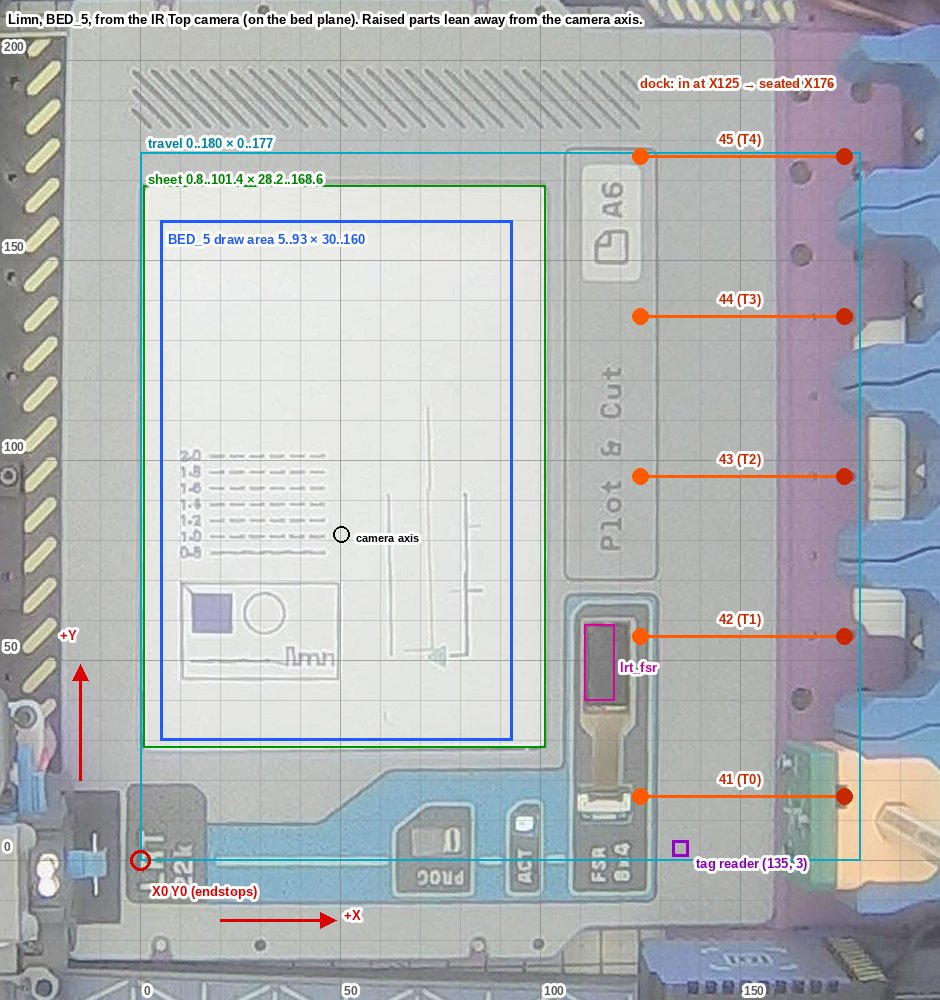

# Limn geometry

Where everything is, in the plotter's own coordinates: the axes, the body, the beds, the dock and tools, the heights, the probe and the camera. Numbers come from the config (`klipper/printer.cfg`, `klipper/limn.cfg`, `ext/limn/beds.py`, `plot/profiles/limn.toml`) unless marked **measured**. Those were taken on the plotter on 2026-09-29 with BED_5 placed, through the IR Top camera and test plots.



*BED_5 from the overhead camera, mapped onto plotter mm (5 mm grid lines, labels every 50). The mapping is exact on the bed plane. Raised parts (holders, carriage, frame) lean outward from the camera axis at about (50, 82), so they sit a few mm closer to it than drawn.*

## Coordinates

- **Units** are mm; Klipper's kinematics are CoreXY.
- **Origin (X0 Y0)** is where the X and Y endstops trigger (`position_endstop: 0`). It sits at the front-left corner of the travel area, next to the "LRT 22k" label on BED_5.
- **+X** runs from the front towards the dock and holders; **+Y** runs from holder 41's side towards holder 45's. On the camera image, +X points up and +Y points left.
- **X/Y are the tool point.** The toolhead position Klipper reports is where the tip of a tool with zero tag offset would be. A tool's tag `DX`/`DY` go on top as a G-code offset (`SET_GCODE_OFFSET`). So a G-code `X` puts the carriage at `X + dx`, and that sum has to stay inside the axis limits (see [Reach](#reach)).
- **Z** grows away from the bed. It homes upwards: the endstop is at Z8, near the top of the range.

The chain for Z, once `_APPLY_OFFSETS` has run:

```
Klipper Z  =  G-code Z  +  tag dz (SET_GCODE_OFFSET Z)  +  bed mesh at (x, y)
```

**Measured:** plotting at `G1 Z1` with the Stabilo (dz −0.06) over the BED_5 `lrt_paper` mesh (about −2), Klipper's Z read between −0.9 and −1.5.

## Axes and limits

| Axis | Range | Endstop | Homing | Notes |
|---|---|---|---|---|
| X | 0 – 180 | 0 (`^!PC2`) | 65 mm/s | `rotation_distance 32`, 16 microsteps |
| Y | 0 – 177 | 0 (`^!PC3`) | 65 mm/s | `rotation_distance 32`, 16 microsteps |
| Z | −3 – 10 | 8 (`^!PC4`), homes up | 3 mm/s, retract 2 | `rotation_distance 0.03125`, 1 microstep |
| K (tool lock, `manual_stepper axis_k`) | 0 – 20 | 0 (`^PA2`) | 10 mm/s | gear 18:1. `K_LOCK`: 0 → 16. `K_UNLOCK`: 16 → 0 |

- `[printer]`: max_velocity 300, max_accel 3000, **max_z_velocity 5, max_z_accel 100**. Z is slow, and Z moves are most of a plot's time; every lift costs about 0.4 s.
- `G28` (the macro) homes Z first, then X, then Y. `G28 X`, `G28 Y` and `G28 Z` pass straight through.
- `[gcode_arcs] resolution: 0.2`: G2/G3 arcs are split into 0.2 mm lines. `plot/` never writes arcs.
- Input shaper (saved): X is mzv at 34.2 Hz, Y is 2hump_ei at 90.2 Hz. The MPU9250 on the rpi MCU has `axes_map: -y, x, z`, and resonance testing probes at (80, 80, 10).

### The Z axis and its play

The Z axis is driven by one lead screw on the right side. It rides on two metal rails: one from the left, one somewhere in the middle. The parts are 3D printed, so the rails needed some clearance. As a result, **the axis has play of a few mm** (measured by hand). It can tilt with the screw side as the pivot, and bow to the front or the back, within limits that depend on the load. It will be tightened, but `plot/` has to cope with rough geometry anyway: plotting directly onto flat-ish 3D printed parts is a goal.

What the play does to a plot:

- **Coming down**, gravity keeps the axis seated, and the pen lands where commanded.
- **Pressing** past first touch doesn't only push the tip in: it lifts the axis within its play. Near the screw the axis is stiff and the press goes into the tip; further away more of it lifts the axis. The same press gives a different line in different places.
- **Going up**, the screw rises first and the axis follows. The pen lets go of the paper only once the axis is back down, so a lift shorter than the press plus the play drags the pen along the next travel: smudges and lines that shouldn't be there.
- **Harder presses make all of this worse.** So every tool has its own press (mm past first touch, `press` in `plot/profiles/pens.toml`), with a `press_max` that nothing exceeds. Fineliners are delicate: 0.15, 0.25 at most, never driven hard. Felt tips take more. A laser never touches, and gravity takes care of the rest.

How `plot/` deals with it (`plot/profile.py`, `Play`; `plot/tools.py`, `Pen`):

- **Pen-down** is `z_touch - press`. `z_touch` (1.2) is where a pen whose tag is right first touches the paper; `limn_cam ladder` writes the tags for it.
- **After a stroke** the pen rises its press, then `play.clear` (0.5), then what the play adds there: `extra = factor(x, y) x press`, at most `play.max`. A travel leaving that spot goes at least that high.
- **The factor** is measured at a few spots on the sheet by `uv run python -m limn_cam play <pen> --spots 'x,y;x,y;..'`. Each spot gets pressed strokes, each followed by a lift to a trial height and a short move on at that height; the overhead camera tells which moves still left ink. The results go to `plot/profiles/play.toml`, which `plot/` reads over `[play]` in `limn.toml`. Between spots the nearer ones count more. Before anything is measured, the factor is `play.per_press` (1.0: the play adds as much again as the press).

Seen from the front, the screw's side should be low Y (to be confirmed). The model doesn't depend on it: spots spread along Y and along X capture the tilt and the bow wherever the pivot is.

## The body, in plotter coordinates (measured)

These were read off the camera image mapped onto the bed. Features that lie in the bed plane are good to about ±1 mm. Raised parts are only rough, because of parallax.

| What | X | Y | Notes |
|---|---|---|---|
| BED_5 plate, front edge | — | ≈ −26 | then the dark front beam |
| BED_5 plate, right edge | ≈ 159.5 | — | the purple dock plate starts here |
| BED_5 plate, top edge | — | ≈ 207 | past the travel area (Y max 177) |
| BED_5 plate, left edge | ≈ −18 | — | ±2, next to the yellow/black striped frame |
| Front screw holes | 5, 30, 84, 100 | ≈ −21 | |
| "LRT 22k" label | −3 – 17 | −11 – 19 | covers the origin |
| PROG switch window | 64 – 83 | −11 – 13 | |
| ACT LED | ≈ 97 | ≈ 9 | |
| "Plot & Cut" / "A6" panel | 106 – 129 | 70 – 178 | |
| FSR window (frame) | 106 – 129 | ≤ 67 | |
| FSR sensor opening | 111 – 124 | 38 – 60 | `lrt_fsr` mesh (111 – 118.5 × 40 – 59) sits in it |
| Paper sheet (A6, as placed) | 0.8 – 101.4 | 28.2 – 168.6 | the physical sheet |
| Hatched strip | 95 – 125 | 186 – 200 | out of reach (Y max 177) |
| Holders 41 – 45 (blue) | ≈ 165 – 200 | 16 / 56 / 96 / 136 / 176 | raised: they appear further out than they are |
| Camera axis (image centre) | 50.4 | 81.5 | on the bed plane |

**The carriage (rough, parallax).** With the tool point commanded to (125, 16) and no tool on, the camera shows:

- the carriage's red LED at about (65, 10);
- its fiducial square at about (86, 43);
- the gantry rod, which runs along Y, at X ≈ 67.

So the carriage body sits roughly 40 – 60 mm on the −X side of the tool point, and the tool hangs off the carriage's +X side. With the carriage at X5 Y5, the body is mostly off the bed to the left (−X) in the camera view, clear of the paper. The snapshots use that position.

## Dock and tools

Five holders sit in a row along Y. Each has a switch on an MCP23017 (I2C bus 1, address 0x20); the tag reader is a PN532 at 0x24.

| Holder | T (Fluidd button) | Manual T | Approach (x, y, z) | Seated at | Switch pin |
|---|---|---|---|---|---|
| 41 | T0 | T5 | (125, 16, 8) | X176 | 15 |
| 42 | T1 | T6 | (125, 56, 8) | X176 | 14 |
| 43 | T2 | T7 | (125, 96, 8) | X176 | 12 |
| 44 | T3 | T8 | (125, 136, 8) | X176 | 11 |
| 45 | T4 | T9 | (125, 176, 8) | X176 | 13 |

`T42` = `UNDOCK`. Holder 45 carries the reference tool (`REFERENCE=1` on its tag); the beds are calibrated with it.

**`_DOCK_TOOL` (dock and undock), in order:**

1. Clear the offsets and go up to **Z9.2**.
2. Move to the approach point `(125, Yh)` at F5500, then down to **Z8**.
3. `K_UNLOCK`.
4. Moving relative, go **+X 25.5** at F5500, then **+X 25.5** at F2500. The tool is now at X176, in its holder.
5. Docking only:
   - nudge `Z+0.5 Y−0.5 X−0.5`, then `X+0.5 Y+0.5`, then `Z−0.5`;
   - then `K_LOCK_UNLOCK_LOCK`.
6. Back out **−X 51** at F2000.
7. Check the holder switch. After docking: `RFID_READ`, then `G28`.

**Tag reader.** `_RFID_HOME` clears offsets and goes X100, then Y3, then X135, then Z7, so the tool point reads at **(135, 3)**. Holding a tool, there is only 1–2 cm along X past that before the dock (`_RFID_NUDGE`).

**Tag offsets.** Accepted ranges: `DX`/`DY` within ±5 (`TOOL_MAX_DXY`), `DZ` −0.5 – 3 (`TOOL_DZ`). DZ is measured over the BLTouch Z; the reference tool is about 1.0. **Measured:** the Stabilo in holder 41 ("Stabilo Test Blue") has dx −2.54, dy −1.12, dz −0.06.

`_DOCK_HOME` has `dock_x 114, dock_y 13, dock_z 7.9`. Note that it moves `G1 Y{dock_x}`, which is probably meant to be `dock_y`.

## Positions the macros go to

| Where | X, Y, Z | Who |
|---|---|---|
| Park after offsets | (42, 123), Z8, then Z7 | `_SAFE_OFFSET_HOME HOME=1`, used by `_CLEAR_OFFSETS` / `_APPLY_OFFSETS HOME=1` around every tool change |
| Nudge off the edges | Z7, then Y ≥ 5, X ≥ 5 | `_SAFE_OFFSET_HOME` (no HOME) |
| After applying offsets | Z7 | `_APPLY_OFFSETS` |
| Before meshing | (65, 45) | `BED_MESH_CALIBRATE`, after `G28 Z` and `UNDOCK` |
| Fluidd pause/cancel park | (120, 0), +4 Z | `_CLIENT_VARIABLE` |
| FSR wipe wait | (60, 100) | `beds.py` BED_5 `clean.park` |
| Plot start (`plot/`) | (42, 123, 7) | `park` in `plot/profiles/limn.toml`, where `_APPLY_OFFSETS HOME=1` leaves it |
| Camera snapshots | (5, 5), Z8, no tool | clear of the paper |

`_SAFE_OFFSET_HOME` goes up (Z8, or Z7) while the tool's offsets and mesh are still on, and `_APPLY_OFFSETS` applies a dz with MOVE=1. Both stay under Z9.5 less the Z offset: a tag dz above 2 would otherwise take Z past 10 (fixed 2026-09-30, the Micron's dz 2.25).

## Heights

Heights in `beds.py` are Klipper Z with no mesh applied. `plot/` heights are G-code Z, with the tag dz and the mesh added by Klipper.

| Z | What |
|---|---|
| 10 / −3 | axis limits |
| 9.2 | dock travel height (`_DOCK_TOOL`) |
| 9 | `PANEL_ZHOME`: travel over the beds (routines, marks) |
| 8 | Z endstop; park and approach height at the holders |
| 7 | after `_APPLY_OFFSETS`; tag reader; **`z_max` for plots** (10 less a dz of up to 3) |
| 6 | `PAPER_ZHOME`: travel over the paper (routines) |
| 5.5 | `[bed_mesh] horizontal_move_z` |
| **5** | `safe_z`: the least the tool is ever at off the paper |
| **2.5** | `plot/` long travels (`z_travel`) |
| **1.2 + 0.5 + play** | `plot/` hops: `z_touch` + `play.clear` + what the play adds for that press, there |
| **1.2** | `z_touch`: where a pen whose tag is right first touches the paper |
| **1.2 − press** | pen-down: 1.05 for a fineliner (press 0.15), 0.9 for a felt tip (0.3). Pens without a press: `z_down`, 1 |
| −2.5 | `z_min` for plots (−3 less a dz of down to −0.5) |

**Measured, 2026-09-30:** with their old tags, pens at pen-down Z1 were pressed 0.7 to 1 mm past touch, and fine lines grew wide and blobby. The camera ladder (`limn_cam ladder`, `notebooks/act-7-camera-ladder.md`) finds each pen's touch; its tags now put touch at `z_touch`.

## Probe and meshes

The BLTouch sits at **x −34.34, y +25** from the tool point, with z_offset 0.8. It probes at 2.5 mm/s, `samples 1`, and stows between samples. To probe a point (x, y), the tool point goes to (x + 34.34, y − 25).

| Mesh | X | Y | Points | From |
|---|---|---|---|---|
| `default` (no bed) | 0 – 110 | 35 – 174 | 4 × 6 | `[bed_mesh]`; saved one: 0 – 110 × 30 – 174, z −2.29 – −0.86 |
| BED_3 `lrt_paper` | 5 – 115 | 100 – 175 | 3 × 3 | `beds.py` |
| BED_3 `lrt_panel` | 25 – 85 | 35 – 85 | 3 × 3 | `beds.py` |
| BED_5 `lrt_paper` | 0 – 93 | 30 – 160 | 4 × 6 | `beds.py`; live: z **−2.57 – −1.20** |
| BED_5 `lrt_fsr` | 111 – 118.5 | 40 – 59 | 4 × 5 | `beds.py`; live: z **+1.87 – +2.01** |

Mesh values are where the surface is, in Klipper Z. The BED_5 paper varies by 1.4 mm across the sheet, and the FSR surface sits about 4 mm above the paper. The meshes belong to one placement of the bed (see README, *Bed meshes and test marks*). The saved copy in the repo's `printer.cfg` is BED_3's `lrt_paper` (5 – 115 × 110 – 174).

## Beds

The Dock reads which bed is placed (`printer.limn.bed`: `BED_3`, `BED_5`, `NONE`). `plot/` takes the bed's `lrt_paper` as its paper and loads that mesh for the plot.

**BED_3**, resistive touch panel:

- Test marks: 6 × 3, at X 20 – 100, Y 120 – 150, 4 mm arms.
- RTP reference grid: 4 × 3, X 30 – 90, Y 42 – 65, parked at Z9.
- Paper grid: 4 × 4, X 30 – 90, Y 110 – 160, parked at Z6.
- Touch points for the transform: (100, 52), (65, 40), (25, 70).

**BED_5**, one FSR array, on the chain Dock → hop 1:

- Array origin at (111.0, 59.6), 2.5 mm pitch. Columns run towards −Y and rows towards +X.
- It reaches −3.75 – +3.75 in X and −8.75 – +11.25 in Y from where a tool comes down, at cell (1.5, 3.5).
- Test marks: 5 × 3, at X 15 – 80, Y 120 – 150.

`MARKS_MAX_X` is 110: marks and plots stay short of the holders.

## Reach

Klipper checks every move against the axis limits *with the G-code offset added*. **Measured:** a plot corner at X2 with the Stabilo (dx −2.54) needed the carriage at X−0.54, and Klipper stopped the print with `Move out of range: -0.540 156.880 7.288`.

So `plot/` only draws where every tool can reach: the travel area less `tool_max_dxy` (5) on every side, which is **X 5 – 175, Y 5 – 172**. Draw areas are clipped to that. For the paper, that gives:

| Bed | Draw area (paper ∩ reach, X ≤ 110) |
|---|---|
| none | 5 – 110 × 35 – 172 |
| BED_3 | 5 – 110 × 100 – 172 |
| BED_5 | 5 – 93 × 30 – 160 |

The holders are a keep-out zone for plot travels: X 112 – 180, the whole Y range.

## The overhead camera (measured)

**Feed.** The IR Top camera is `webcam4`: 1920 × 1080 snapshots at `/webcam4/?action=snapshot`. On its image, +X points up and +Y points left, at about 3.1 px/mm over the paper.

**Mapping.** From camera pixel `(u, v)` to bed mm `(x, y)`, taking `[x', y', w] = H · [u, v, 1]` and then `x = x'/w, y = y'/w`:

```
H = [[-9.584786310e-03, -3.542146078e-01,  2.510453004e+02],
     [-3.573356867e-01,  9.454458306e-03,  4.197321678e+02],
     [-5.033155067e-06,  1.520318739e-05,  1.000000000e+00]]
```

**How it was fitted.** The fit came from a frame plotted at (7, 32) – (91, 158). Before and after snapshots were taken with the carriage at X5 Y5, the new ink found from their difference, and the frame's edges fitted as lines.

**Accuracy.** Over the paper the drawn edges are straight to about 0.2 mm, so lens distortion is negligible there. It holds while the camera stays where it is. Outside the paper, and for anything raised, expect a few mm of error.

**Bed art.** `slicer/limn-bed-art-combined.svg`, the preview's bed art, is not BED_5. It shows the A6/A5 calibration-bed layout. Its A6 outline lands within a few mm of the real sheet, but none of BED_5's features (Plot & Cut, FSR window, PROG, ACT) are in it.

## Where each number lives

| Numbers | File |
|---|---|
| Axes, endstops, limits, probe, default mesh, saved meshes | `klipper/printer.cfg` (live `printer.cfg` on the Pi; `SAVE_CONFIG` writes there) |
| Dock approach, strokes, heights, parks, tag reader path, T macros | `klipper/limn.cfg` (`_DOCK_HOME` variables, `_DOCK_TOOL`, `_RFID_HOME`, `_SAFE_OFFSET_HOME`) |
| Holder switch pins, I2C addresses | `klipper/limn.cfg` `[limn]` |
| Beds, meshes, marks, RTP/FSR geometry, `PANEL_ZHOME`, `PAPER_ZHOME`, tag limits | `ext/limn/beds.py` |
| Plot heights, draw areas, zones, reach, park | `plot/profiles/limn.toml` |
| Pens: width, pen-down, hop | `plot/profiles/tools.toml`, `plot/tools.py` |
| Pens: press, press_max (by pen) | `plot/profiles/pens.toml` |
| z_touch, the play model | `plot/profiles/limn.toml` (`z_touch`, `[play]`), measured spots in `plot/profiles/play.toml` (`limn_cam play`) |
