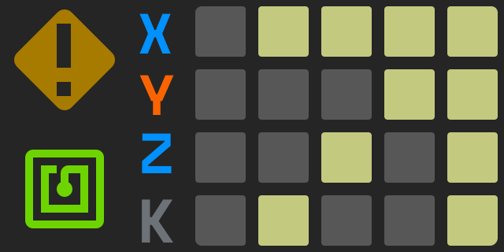

# Limn

Limn is a pen plotter with a toolchanger. This repository contains the various klipper configuration files and some extra modules.

- `klipper/`: Klipper configuration for the toolchanger and printer.
- `ext/limn/`: Klipper extension for the Dock and the calibration beds (`LRT_*` commands). Install with `ln -sfn ~/limn/ext/limn ~/klipper/klippy/extras/limn`, tests: `uv run python ext/tests/test_*.py`.
- `ext/limn/tool_holder.py`: The tool holders' switches (MCP23017) and the tool tags (PN532), read by the extension straight off the Pi's I2C bus (`tool_holder_*` in `[limn]`). Commands: `TOOL_HOLDERS`, `TOOL_HOLDER_CHECK T= EXPECT=occupied|empty`, `TOOL_TAG_READ`, `TOOL_TAG_WRITE [DX= DY= DZ= NAME= REFERENCE=0|1]`. Klipper's user needs to be in the `i2c` group.
  Pens can also be scanned by hand: hold the pen to the reader until it beeps, then put it into a holder within 8 s. That holder has that pen (`TOOL_TAGS`, the web UI) until a hand empties it again; docking and undocking don't. Between tool changes the reader listens every 2 s (every 5 s while printing, `tool_holder_scan_idle` / `tool_holder_scan_printing` in `[limn]`, 0: off), and every 0.5 s for a minute after a hand was on the holders.
- `limn_cam/`: What the cameras see of a plot: the Z ladder that finds where each pen touches the paper, from a photo (`uv run python -m limn_cam ladder T0 T1`); homographies, the ink map, ArUco tags. Optional: nothing else needs it; OpenCV (for the tags) is an extra, `uv sync --extra cam`. See `notebooks/act-7-camera-ladder.md`.
- `micropython/`: Firmware for the Dock and the bed MCUs, and `mcu.py` to install and update them.
- `plot/`: SVG to G-code, and the web UI to place, paint, preview and plot drawings (`plot/README.md`). On the Pi, supervisord runs it on port 4219 (`limn_web.conf`, see *Web UI on the Pi*).
- `slicer/`: The old PrusaSlicer setup, retired: `plot/` replaces it. Don't plot its G-code: its pen moves needed the `G1` ACT macro, which is gone, and without it `G1 Z0 ACT1` drives the pen to Z0.
- `GEOMETRY.md`: where everything is, in plotter coordinates: axes, body, beds, dock and tools, heights, probe, camera.
- `step/`: (todo) 3D Printable Parts


## Web UI on the Pi

The plot UI runs next to Klipper and talks to Moonraker on the same Pi. Its workspace (the job, dropped SVGs, fonts) is `~/limn/plot-data`.

```sh
cd ~/limn && git pull && uv sync        # the plot dependencies (shapely, svgelements, fonttools, uharfbuzz, ..)
sudo ln -sf ~/limn/limn_web.conf /etc/supervisor/conf.d/limn_web.conf
sudo supervisorctl reread && sudo supervisorctl update
sudo supervisorctl status limn_web      # then http://<pi>:4219
```

After a `git pull` that changes `plot/`: `sudo supervisorctl restart limn_web`. It has no login: keep it on the LAN.

Scans (the Scan tab) are kept in the Pi's memory (`/dev/shm/limn-captures`, at most 2 GB, the oldest go first): a reboot loses them. To keep them, set up the NAS in the Scan tab's *NAS* panel: an S3 endpoint (eg. OpenMediaVault's S3 plugin), bucket, folder and keys, saved in `~/limn/plot-data/nas.json` (its owner only); *Check* writes a small file there. Then ⇪ uploads a capture, or tick *upload each scan when done*. Stitching for film is Hugin's: `sudo apt install hugin-tools enblend`.


## Bed meshes and test marks

`LRT_MESH_CALIBRATE` takes the meshes of the bed on the plotter (`meshes` in `ext/limn/beds.py`); with no bed on the plotter, the whole bed as `[bed_mesh]` in `printer.cfg` has it. A bed it doesn't know, it doesn't probe. `IF_STALE=1` only meshes when the meshes aren't of the bed as it sits now.

The meshes and the test marks belong to one placement of the bed. The Dock counts the beds placed and removed since it booted (`read_bed_id()`, see `micropython/STRATEGY.md`), so this holds over Klipper restarts. Once the bed has been off, or the Dock restarted, `LRT_PROBE_TOOL` meshes the bed again before probing the tool (and takes the tool back after), and the marks start over at the first one. The tools' tags stay as they are. The meshes are only in memory until `SAVE_CONFIG`; a restart without it meshes again too. Dock firmware without the count: the meshes are trusted until Klipper restarts.

Meshing a calibrated bed again also probes the calibration's bed z again (BLTouch, nothing on the carriage), which the tools' dz are measured against. Then, when holder 45 has the reference tool, tagged `REFERENCE=1` (`LRT_CALIBRATE` tags it), it is docked and the reference points are taken again too: a full calibration. Otherwise the old reference points stay, and tools probed after the move are off in XY by about as much as the bed moved. That's fine as long as the pens only have to agree with each other.

After `LRT_CALIBRATE` and `LRT_PROBE_TOOL` the tool draws a test mark on the paper: a corner that makes a `+` with the corner the previous tool left, and a corner at the next point for the next tool. Two pens that disagree show a step in the `+`: in its vertical line for X, in its horizontal line for Y. `LRT_MARKS` shows where the next one goes, `LRT_MARKS RESET=1` starts over on a new sheet.

Nothing is probed or drawn when a pen could hit the bed or the tools:
- Meshing puts the carried tool away first (`UNDOCK` in the `BED_MESH_CALIBRATE` macro). Empty holders are normal. With no tool saved as carried, the key locked (the `axis_k` endstop open) and exactly one holder empty, that tool is taken as the carried one and put away. With the key open, nothing is guessed: keeping the carriage empty is up to you.
- A mark is only drawn with a carried tool, with a paper mesh of this placement, inside that mesh and short of the holders (`MARKS_MAX_X`), and with sane offsets on its tag (`TOOL_MAX_DXY`, `TOOL_DZ`). The pen travels at the beds' travel height and comes down only over the mark.

There is some more info posted [here](https://hackaday.io/project/205431-limn-pen-plotter-with-toolchanger) about this project.

## LEDs

The extension sets the tool holder and UI LEDs from what it knows. `klipper/leds.cfg` has how each state looks (`_led_styles`); `TOOL_LEDS` redraws them and lists the states.

**The UI matrix** is a Pimoroni Unicorn pHAT: 8 × 4 RGB LEDs, Klipper's `[neopixel picam]` (`rpi:gpio15`, GRB), numbered 1 – 32 row by row from the top left. Each part has its own `led_effect` in `klipper/leds.cfg`:



```
  1  2 |  3 |  4  5  6 |  7 |  8      1 2 9 10      ui_alert        the machine's mood (below)
  9 10 | 11 | 12 13 14 | 15 | 16      3 11 19       ui_*stepper_*   the X, Y, Z endstops
 17 18 | 19 | 20 21 22 | 23 | 24      27            ui_key_*        K: the toolchanger's key, red locked, green open
 25 26 | 27 | 28 29 30 | 31 | 32      17 18 25 26   ui_tag          the tag reader
                                      cols 4 – 6    ui_tool_41..45  a tool's number in pixels (T0 is holder 41)
                                      16 24 32      ui_traffic_*    the tool change: red, yellow, green
```

The art (`docs/led-matrix-ui.svg`, 40 px a LED) is what the matrix means: the alert sign over the top left 2 × 2, X Y Z K down column 3, the tag sign over the bottom left 2 × 2. The plot UI's *Display* panel shows the matrix and the dock strip live, from the LEDs' own colours in Klipper (`neopixel picam`, `neopixel indockator`), with the art over them and, from `printer.limn.leds`, what each part says.

| Where | State | Means |
|---|---|---|
| Dock strip, per holder | green | tool in its holder |
| | off | holder empty (its tool on the carriage, or missing), or holders unreadable |
| | red | the check at this holder failed |
| Fluidd tool buttons `T0`..`T4` | dot colour / highlight | green home, no dot empty, red failed / the carried tool (`tool_holder_macros` in `[limn]`) |
| UI digit | the tool's number: T0 (holder 41) shows 0 | |
| | blue, breathing | tool being changed |
| | amber / white | carried tool, tag not read / tag applied |
| UI column 8 (red, yellow, green) | red, yellow, green blinking, green | tool change: travelling, at the holder, leaving, done. Red blinking: failed, until the next change or `DOCK_RESET` |
| UI tag (bottom left) | blue blink / green / red blink | reading / applied / failed |
| | dim cyan, breathing / cyan, quick blink | listening for a pen held to the reader (a hand was on the holders) / a pen was scanned: into its holder now |
| | green / red blink | a holder took the scanned pen / it went in too late, or into two holders at once |
| UI alert (top left), most urgent first | red, fast then slow blink | a check failed or the holders can't be read (fast for the first 3 s) |
| | blue spinner, faster near the holder | tool change: travelling, at the holder, leaving |
| | cyan spinner | reading or writing a tag |
| | green, quick blink | a tool change just went well |
| | amber blink, slowing down over 5 s | a hand was on the holders |
| | amber, breathing | a tool is unaccounted for, or the carried tool's tag failed |
| | green, breathing | carrying a tool with its tag read: ready |
| | dim green, slow | all tools home |
| Holder, UI digit, UI alert | amber, orange, red, blinking faster; the alert's 2x2 goes round red and amber | a known pen has been out of its cap too long: its pen's `dry` minutes in `plot/profiles/pens.toml` (fineliners 10, the Stabilo 88's dry-safe ink 240), else 10 min (`tool_dry_idle`); twice that while printing (`tool_dry_printing`). It beeps every 3 s (`tool_dry_beep`). `TOOL_DRY` shows the clocks, `TOOL_DRY RESET=1 T=41` restarts one (primed), `SILENCE=1` stops the beeps; taking the pen out by hand stops its clock |

## Toolhead wiring and the endoscope

**Cable chain** to the toolhead, open on one side (ventilated):
- Z: NEMA 8 stepper, its 4 wires in a silicone ribbon.
- K: 10 mm linear micro stepper, its 4 wires in a silicone ribbon.
- The stepper drivers run at 5V.
- A USB-C cable.
- A ribbon with the endstops, the accelerometer and future toolhead sensors.
- Mostly 26 AWG, with a short 30 AWG piece. 26 AWG is ~0.134 ohm/m (~2.2 A chassis rating), 30 AWG ~0.34 ohm/m (~0.86 A). A 30 AWG piece only a few cm long can carry more than that: the thicker wire at its ends draws the heat away. On 5V the voltage drop is the limit: the GND wire carries the same current, so count the run twice; doubling 5V and GND halves the drop.
- Planned: pogo pins on the toolhead, tool power through the coupling (see *Toolhead rework* in `TODO.md`).

**Endoscope camera** (on the toolhead), reclaimed from single-use medical endoscopes:
- USB decoder board `0bde:8076` "Xitech USB Camera", UVC, 400x400 only (YUYV or MJPG, 30 fps). In crowsnest: `[cam endocam]`, ustreamer, port 8082 (`/webcam3/`), device `/dev/v4l/by-id/usb-Xitech_USB_Camera_20240610-video-index0`. The Fluidd webcam entry "axiscam" points at `/webcam3/` too, so it shows the endoscope. Crowsnest doesn't reopen a camera that was unplugged: restart it.
- The sensor has 4 wires to the board through our adapter: VDD, GND, VCLK, VOUT. VOUT is raw analog: one pixel's level per VCLK tick, no sync like composite video. The board drives the clock, samples VOUT and builds the frames. A bad contact on VOUT/VCLK shows as a camera that enumerates and streams nothing. Adapter rules: a GND between VOUT and VCLK, short runs away from the stepper wires, decoupling on VDD near the sensor, never plug the sensor in while the board is powered.
- The board's potentiometer is in the signal path (VOUT's level into the board, likely).
- No LEDs at the tip: light goes in through two fibers on the connector's optical port, ~1 cm from the camera connector. Each fiber end is Ø0.9 mm, 1.40 mm apart (hand-measured, ±0.1-0.2 mm; render: `~/limn-shot/endo-connector-model-20261001.png`). A 1W LED shone at it lights objects 5-10 mm from the tip. Couple a small flat emitter (~2 mm, covering both fibers) to within ~0.1 mm of the face; a collimating lens doesn't help. The fibers are likely plastic: keep a hot LED off the face.
- LED power: ~3.0V × 350 mA ≈ 1 W at the LED; from 24V through a buck constant-current driver ~50 mA, from 5V 0.25-0.35 A. Switched on only for snapshots (on/off, not PWM: the camera shows PWM as bands).

## Linking the Klipper config

Symlink the repo's `klipper/` folder into Klipper's config folder instead of copying the files over:

```sh
ln -sfn ~/limn/klipper ~/printer_data/config/limn
ln -sfn ~/limn/ext/limn ~/klipper/klippy/extras/limn
```

Then in `~/printer_data/config/printer.cfg` include them through the link:

```ini
[include limn/limn.cfg]
[include limn/leds.cfg]
[include limn/buzzer.cfg]
```

- `printer.cfg` itself stays a real file in `~/printer_data/config/`. `SAVE_CONFIG` rewrites it by renaming a new file over it, so a symlink would be replaced by a plain copy, and the saved `[limn]` calibration would stop reaching the repo. `klipper/printer.cfg` in the repo is a reference copy (the tests read its `SAVE_CONFIG` block); copy it back when you want the repo to have the latest calibration.
- Klipper resolves `[include]` relative to the file that has it. `limn.cfg` ends with `[include limn-tools.cfg]`, which through the link means `~/limn/klipper/limn-tools.cfg`. Either move that file into the repo's `klipper/`, or move the `[include limn-tools.cfg]` line from `limn.cfg` into `printer.cfg`.
- Editing the linked files in Fluidd/Mainsail edits the repo's files. After a `git pull`, `RESTART` picks up config changes; changes under `ext/limn` need `sudo systemctl restart klipper`, since Klipper imports its extras only once.
